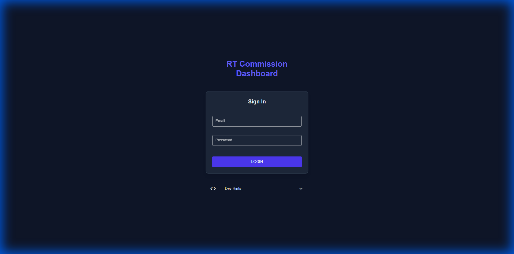
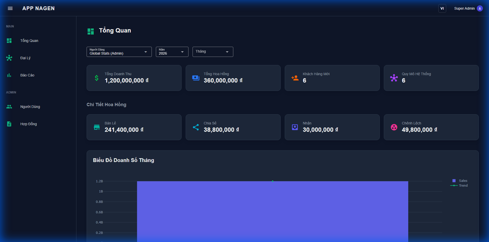
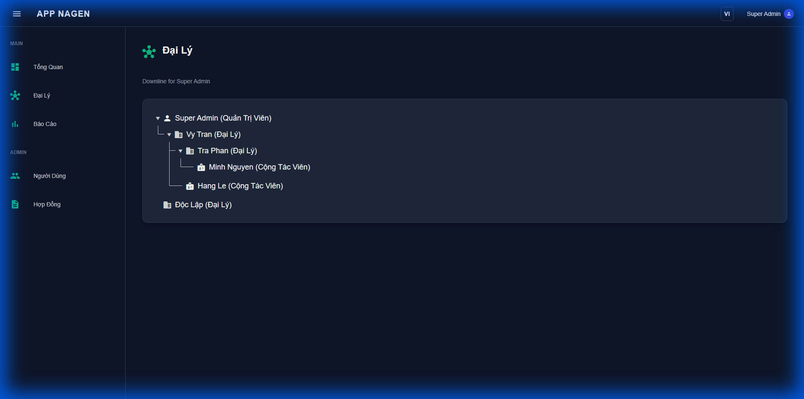
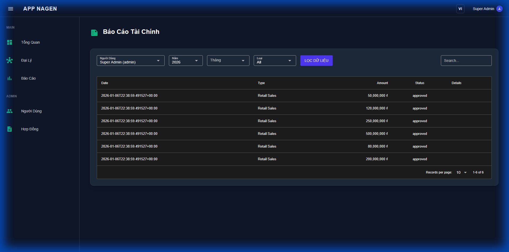
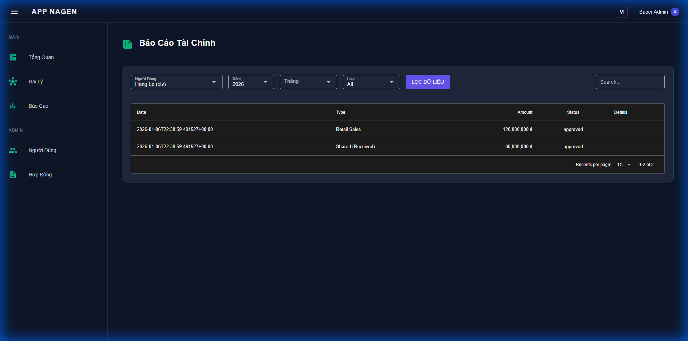
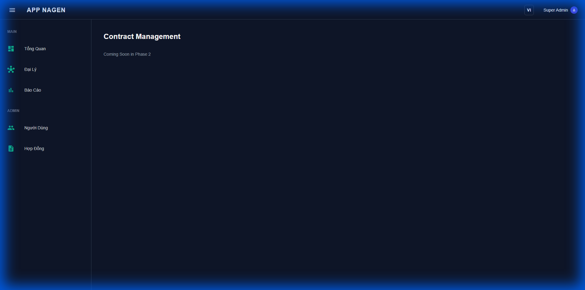

# RT Commission Dashboard - Hướng Dẫn Sử Dụng

Chào mừng bạn đến với RT Commission Dashboard. Hướng dẫn này sẽ giúp bạn điều hướng hệ thống, quản lý mạng lưới và theo dõi hiệu suất tài chính của mình.

## 1. Bắt Đầu

### Đăng Nhập
Để truy cập dashboard, nhập email và mật khẩu đã đăng ký của bạn.

*   **Email**: Địa chỉ email đã đăng ký của bạn (ví dụ: `admin@rt.local`)
*   **Mật Khẩu**: Mật khẩu bảo mật của bạn

## 2. Tổng Quan Dashboard (Overview)

Sau khi đăng nhập, bạn sẽ thấy giao diện chính. Trang này cung cấp cái nhìn tổng quan về hiệu suất kinh doanh của bạn.

### Các Chỉ Số Chính
*   **Tổng Doanh Thu**: Tổng giá trị của tất cả các đơn bán lẻ đã được duyệt.
*   **Tổng Hoa Hồng**: Tổng thu nhập của bạn từ mọi nguồn (Trực tiếp, Chia sẻ, Mạng lưới).
*   **Khách Hàng Mới**: Số lượng khách hàng mới có được trong khoảng thời gian đã chọn.
*   **Quy Mô Hệ Thống**: Tổng số lượng đại lý và cộng tác viên trong tuyến dưới của bạn.

### Bộ Lọc
*   **Năm/Tháng**: Sử dụng các menu thả xuống ở trên cùng để lọc dữ liệu theo khoảng thời gian cụ thể.
*   **Bộ Chọn Người Dùng**: (Dành cho Quản trị viên/Trưởng nhóm) Chọn một thành viên cụ thể trong nhóm để xem hiệu suất cá nhân của họ.

## 3. Quản Lý Đại Lý

Trang **Đại Lý** cho phép bạn xem và quản lý cấu trúc mạng lưới của mình.

*   **Chế Độ Xem Cây**: Nhấp vào các mũi tên để mở rộng hoặc thu gọn các nhánh khác nhau trong mạng lưới của bạn.
*   **Vai Trò**: Nhanh chóng xác định vai trò của người dùng (Đại lý, CTV) bên cạnh tên của họ.

## 4. Báo Cáo

Trang **Báo Cáo** chứa lịch sử giao dịch chi tiết. Đây là nơi bạn xác minh thu nhập của mình.

### Hiểu Về Các Loại Giao Dịch
Cột "Type" (Loại) cho bạn biết bản chất của giao dịch:

*   **Retail (Bán Lẻ)**: Một giao dịch bán hàng trực tiếp do bạn thực hiện.
*   **Shared (Given) - Chia Sẻ (Đã Cấp)**: Một giao dịch bán hàng mà bạn đã chia sẻ hoa hồng với người dùng khác.
*   **Shared (Received) - Chia Sẻ (Đã Nhận)**: Một khoản hoa hồng bạn nhận được từ giao dịch bán hàng của người khác.

## 5. Hợp Đồng

Trang **Hợp Đồng** hiện đang được phát triển cho Giai đoạn 2.

