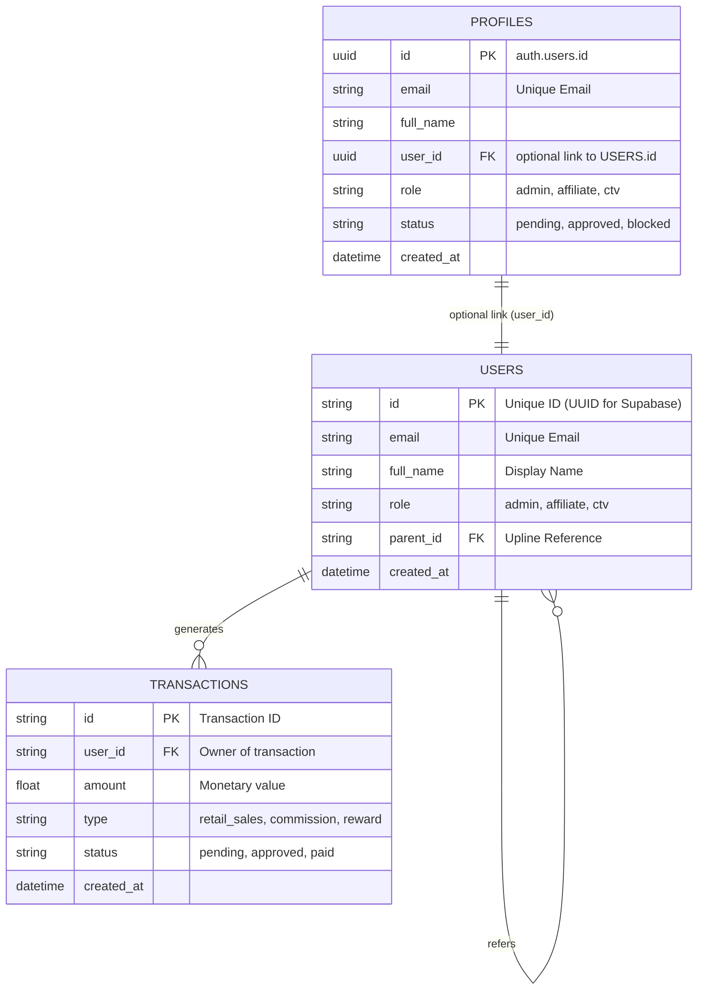

# RT Commission Dashboard - Database Schema

This document defines the data structures used by the RT Commission Dashboard.
The schema is designed to work with **SQLite** (Phase 1) and **Supabase/PostgreSQL** (Phase 2).
In Supabase, dashboard access is governed by `profiles` (keyed to `auth.users`); core data remains in `users`, `transactions`, and `monthly_stats`.

## Entity Relationship Diagram (ERD)



## Table Definitions

### 1. Users (`users`)
Stores all account types. Self-referencing `parent_id` for affiliate tree (Q1 Permission).

| Column | Type (SQLite) | Type (Supabase) | Description |
| :--- | :--- | :--- | :--- |
| `id` | `TEXT` | `uuid` | Primary Key. |
| `email` | `TEXT` | `varchar` | Unique login email. |
| `username` | `TEXT` | `varchar` | Optional unique username/handle. |
| `full_name` | `TEXT` | `varchar` | Display Name. |
| `role` | `TEXT` | `varchar` | Enum: `ctv` (CTV), `agent` (Đại lý), `pro_agent` (Đại lý CN), `partner` (Đối tác CL), `admin`. |
| `permissions` | `TEXT` | `jsonb` | JSON List: `['Q1', 'Q2', 'Q3', 'Q4']`. |
| `parent_id` | `TEXT` | `uuid` | Upline ID. |
| `created_at` | `DATETIME` | `timestamptz` | Account creation. |

### 1b. Profiles (`profiles`, Supabase only)
Dashboard access identities keyed to `auth.users`. May optionally link to a `users.id` for data visibility; some profiles may have no linked user and some users may have no profile (sales-only).

| Column | Type (Supabase) | Description |
| :--- | :--- | :--- |
| `id` | `uuid` | Primary Key = `auth.users.id`. |
| `email` | `citext` | Unique email (auth). |
| `full_name` | `text` | Display name. |
| `user_id` | `uuid` | Nullable FK to `users.id` (for data linkage). |
| `role` | `text` | `admin`, `affiliate`, `ctv`; default `ctv`. |
| `status` | `text` | `pending`, `approved`, `blocked`; default `pending`. |
| `approved_by` | `uuid` | FK to `profiles.id`. |
| `approved_at` | `timestamptz` | Approval timestamp. |
| `created_at` | `timestamptz` | Creation time. |

### 2. Transactions (`transactions`)
Records all financial events.
*   **Revenue**: `type` = 'retail_sales'.
*   **Commissions**: `type` = 'commission_sharing' (linked to a retail sale via `reference_id`).

| Column | Type (SQLite) | Type (Supabase) | Description |
| :--- | :--- | :--- | :--- |
| `id` | `TEXT` | `text` | Primary Key. |
| `user_id` | `TEXT` | `uuid` | Who gets the money/credit. |
| `amount` | `REAL` | `numeric` | Transaction value. |
| `type` | `TEXT` | `varchar` | Enum: `retail_sales`, `commission`, `kpi_reward`. |
| `status` | `TEXT` | `varchar` | Enum: `pending`, `approved`. |
| `reference_id` | `TEXT` | `text` | ID of the source transaction (e.g., the retail sale that generated this comm). |
| `shared_with_id` | `TEXT` | `uuid` | For Shared Opportunities: The other beneficiary User ID. |
| `metadata` | `TEXT` | `jsonb` | JSON: `{customer_name, product_id, order_details}`. |
| `created_at` | `DATETIME` | `timestamptz` | timestamp. |

### 3. Monthly Stats (`monthly_stats`)
Stateful snapshot of monthly performance. Used for dashboards and computing tier rates.

| Column | Type (SQLite) | Type (Supabase) | Description |
| :--- | :--- | :--- | :--- |
| `id` | `TEXT` | `text` | Composite Key: `{user_id}_{YYYY-MM}`. |
| `user_id` | `TEXT` | `uuid` | Foreign Key to Users. |
| `month` | `TEXT` | `varchar` | Period: `YYYY-MM`. |
| `personal_sales_volume` | `REAL` | `numeric` | Direct Retail Sales value (100% counts for tier ranking). |
| `shared_out_volume` | `REAL` | `numeric` | Full volume of sales shared with others (100% counts for tier ranking). |
| `received_volume` | `REAL` | `numeric` | Volume received from others (does NOT count for tier ranking). |
| `tier_rate` | `REAL` | `numeric` | Effective Commission Rate (0.04 to 0.35). |
| `comm_direct` | `REAL` | `numeric` | Earnings from Personal Sales. |
| `comm_shared` | `REAL` | `numeric` | Earnings from Shared Sales. |
| `comm_received` | `REAL` | `numeric` | Earnings from Received Sales. |
| `comm_override` | `REAL` | `numeric` | Earnings from Downline Differential. |
| `total_commission` | `REAL` | `numeric` | Total Earnings. |

### 4. Products (`products`, Supabase only)
Synced from Shopify. optimized for Fuzzy Search.

| Column | Type (Supabase) | Description |
| :--- | :--- | :--- |
| `id` | `text` | Primary Key (Shopify Product ID). |
| `title` | `text` | Product Name (Indexed for Search). |
| `body_html` | `text` | Description. |
| `vendor` | `text` | Brand/Vendor. |
| `product_type` | `text` | Category. |
| `status` | `text` | `active`, `archived`, `draft`. |
| `variants` | `jsonb` | List of variants (SKU, Price, Option). |
| `images` | `jsonb` | List of images. |
| `created_at` | `timestamptz` | Shopify creation time. |
| `updated_at` | `timestamptz` | Shopify update time. |

## 4. Data Lifecycle & Operations

### A. Transactions (`transactions`)
*   **Retail Sales (`retail_sales`)**: 
    *   **How to Insert**: MUST use `db.create_retail_sale(user_id, amount, ...)` in Python.
    *   **Why**: This method acts as the **Trigger**. It inserts the sale record *AND* immediately initiates the commission calculation sequence.
    *   **Warning**: Inserting directly via SQL will **NOT** generate commissions or update monthly stats.
*   **Commissions**: Generated automatically by the system.
*   **Rewards (`kpi_reward`)**: Inserted manually via SQL or Admin UI.

### B. Monthly Stats (`monthly_stats`)
This table is **System-Managed**. It acts as a live cache of the month's performance.

*   **Creation**: A row `{user_id}_{YYYY-MM}` is automatically created the first time any activity (sale, shared sale, or commission) occurs for that user in the month.
*   **Update Mechanism (Stateful Recalculation)**:
    1.  **Trigger**: A `retail_sales` transaction is committed.
    2.  **Volume Update**: The system updates the `personal_sales_volume` (or shared volumes) for the seller.
    3.  **Tier Recalculation**: Based on the new total volume, the `tier_rate` is updated (e.g., from 20% -> 22%).
    4.  **Commission Sync**: The system re-calculates all commission earnings (`comm_direct`, `comm_override`) for the *entire month* using the new rate.
    5.  **Upline Propagation**: This process repeats recursively for the user's direct parent (`parent_id`) up to the root or max levels.

## 5. Appendix: Supabase Automation Logic
To enable automatic `monthly_stats` updates on Supabase without relying on Python, use this PL/pgSQL Trigger.

### 1. Helper: Calculate Tier Rate
```sql
CREATE OR REPLACE FUNCTION get_commission_rate(volume NUMERIC) 
RETURNS NUMERIC AS $$
BEGIN
    IF volume > 2000000000 THEN RETURN 0.35;
    ELSIF volume > 1000000000 THEN RETURN 0.30;
    ELSIF volume > 400000000 THEN RETURN 0.25;
    ELSIF volume > 200000000 THEN RETURN 0.22;
    ELSE RETURN 0.20;
    END IF;
END;
$$ LANGUAGE plpgsql;
```

### 2. Core Logic: Recalculate Stats & Commissions
```sql
CREATE OR REPLACE PROCEDURE recalculate_monthly_stats(p_user_id TEXT, p_month TEXT)
LANGUAGE plpgsql AS $$
DECLARE
    v_total_vol NUMERIC;
    v_new_rate NUMERIC;
    v_parent_id TEXT;
    v_stat_id TEXT := p_user_id || '_' || p_month;
BEGIN
    -- 1. Calculate Total Volume (Personal + Shared + Received)
    SELECT COALESCE(SUM(personal_sales_volume + shared_out_volume + received_volume), 0)
    INTO v_total_vol
    FROM monthly_stats
    WHERE id = v_stat_id;

    -- 2. Determine New Rate
    v_new_rate := get_commission_rate(v_total_vol);

    -- 3. Update Stats Table
    UPDATE monthly_stats 
    SET tier_rate = v_new_rate,
        total_commission = (personal_sales_volume * v_new_rate) -- Simplified Example
    WHERE id = v_stat_id;

    -- 4. Recursive Propagation (Find Parent & Recalculate)
    SELECT parent_id INTO v_parent_id FROM users WHERE id = p_user_id;
    
    IF v_parent_id IS NOT NULL THEN
        -- In a real implementation, you would update the parent's "Downline Volume" here before calling calc
        CALL recalculate_monthly_stats(v_parent_id, p_month);
    END IF;
END;
$$;
```

### 3. The Trigger Function
```sql
CREATE OR REPLACE FUNCTION handle_new_transaction()
RETURNS TRIGGER AS $$
DECLARE
    v_month TEXT;
    v_stat_id TEXT;
BEGIN
    IF NEW.type = 'retail_sales' THEN
        v_month := to_char(NEW.created_at, 'YYYY-MM');
        v_stat_id := NEW.user_id || '_' || v_month;

        -- 1. Upsert Initial Volume
        INSERT INTO monthly_stats (id, user_id, month, personal_sales_volume, last_updated)
        VALUES (v_stat_id, NEW.user_id, v_month, NEW.amount, NOW())
        ON CONFLICT (id) DO UPDATE 
        SET personal_sales_volume = monthly_stats.personal_sales_volume + EXCLUDED.personal_sales_volume,
            last_updated = NOW();

        -- 2. Trigger Recalculation Chain
        CALL recalculate_monthly_stats(NEW.user_id, v_month);
    END IF;
    RETURN NEW;
END;
$$ LANGUAGE plpgsql;
```

### 4. The Trigger Definition
```sql
CREATE TRIGGER on_transaction_insert
AFTER INSERT ON transactions
FOR EACH ROW EXECUTE FUNCTION handle_new_transaction();
```

### 5. Product Search Logic (Fuzzy Matching)
To enable robust product search handling typos (e.g. "sunghen" -> "SUNGEN"), use `pg_trgm`.

#### 1. Enable Extension
```sql
CREATE EXTENSION IF NOT EXISTS pg_trgm;
```

#### 2. Create Index
```sql
CREATE INDEX IF NOT EXISTS idx_products_name_trgm ON public.products USING gin (title gin_trgm_ops);
```

#### 3. RPC Function: `search_products_fuzzy`
Call this from Kestra/App via `supabase.rpc('search_products_fuzzy', { 'search_term': '...' })`.

```sql
CREATE OR REPLACE FUNCTION search_products_fuzzy(search_term TEXT)
RETURNS SETOF products AS $$
BEGIN
    RETURN QUERY
    SELECT *
    FROM products
    WHERE 
        title ILIKE '%' || search_term || '%'
        OR
        similarity(title, search_term) > 0.3
    ORDER BY 
        similarity(title, search_term) DESC, 
        title ASC
    LIMIT 10;
END;
$$ LANGUAGE plpgsql;
```
