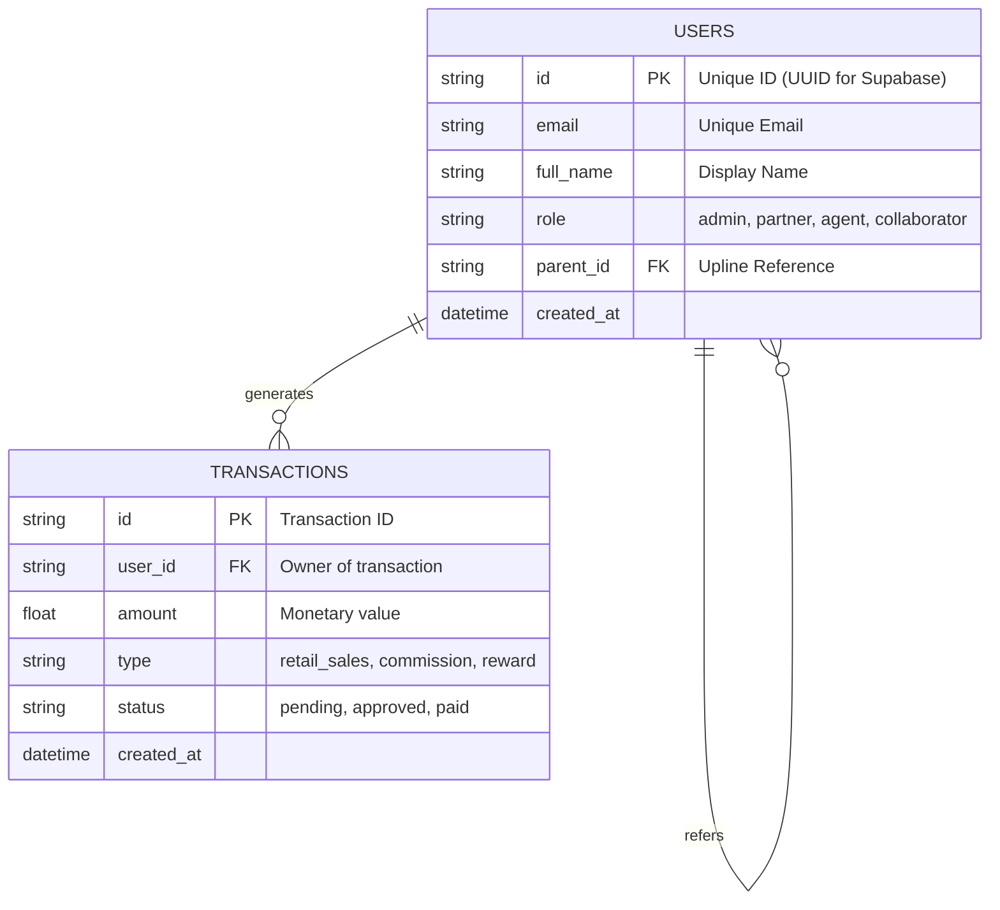

# RT Commission Dashboard - Database Schema

This document defines the data structures used by the RT Commission Dashboard.
The schema is designed to work with **SQLite** (Phase 1) and **Supabase/PostgreSQL** (Phase 2).

## Entity Relationship Diagram (ERD)

## Table Definitions

### 1. Users (`users`)
Stores all account types. Self-referencing `parent_id` for affiliate tree (Q1 Permission).

| Column | Type (SQLite) | Type (Supabase) | Description |
| :--- | :--- | :--- | :--- |
| `id` | `TEXT` | `uuid` | Primary Key. |
| `email` | `TEXT` | `varchar` | Unique login email. |
| `full_name` | `TEXT` | `varchar` | Display Name. |
| `role` | `TEXT` | `varchar` | Enum: `ctv` (CTV), `agent` (Đại lý), `pro_agent` (Đại lý CN), `partner` (Đối tác CL), `admin`. |
| `permissions` | `TEXT` | `jsonb` | JSON List: `['Q1', 'Q2', 'Q3', 'Q4']`. |
| `parent_id` | `TEXT` | `uuid` | Upline ID. |
| `created_at` | `DATETIME` | `timestamptz` | Account creation. |

### 2. Transactions (`transactions`)
Records all financial events.
*   **Revenue**: `type` = 'retail_sales'.
*   **Commissions**: `type` = 'commission_sharing' (linked to a retail sale via `reference_id`).

| Column | Type (SQLite) | Type (Supabase) | Description |
| :--- | :--- | :--- | :--- |
| `id` | `TEXT` | `uuid` | Primary Key. |
| `user_id` | `TEXT` | `uuid` | Who gets the money/credit. |
| `amount` | `REAL` | `numeric` | Transaction value. |
| `type` | `TEXT` | `varchar` | Enum: `retail_sales`, `commission`, `kpi_reward`. |
| `status` | `TEXT` | `varchar` | Enum: `pending`, `approved`. |
| `reference_id` | `TEXT` | `uuid` | ID of the source transaction (e.g., the retail sale that generated this comm). |
| `metadata` | `TEXT` | `jsonb` | JSON: `{customer_name, product_id, order_details}`. |
| `created_at` | `DATETIME` | `timestamptz` | timestamp. |

## Implementation Notes

- **Phase 1 (SQLite)**: Tables are created automatically by `DBHandler._init_db()` if they don't exist.
- **Phase 2 (Supabase)**: These tables will need to be created in the Supabase Dashboard SQL Editor.
