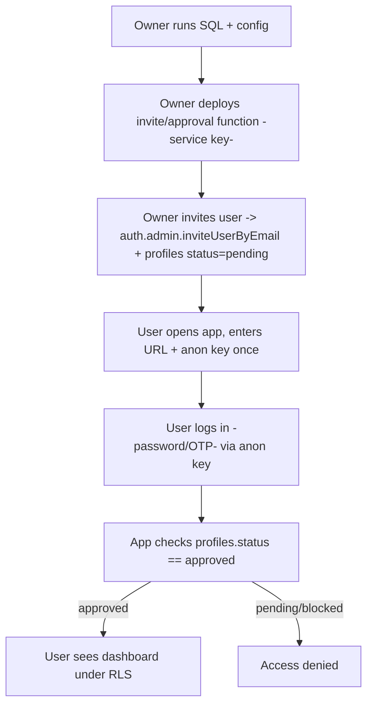

# Phase 2: Supabase Migration Plan

## Overview
Migrate from local SQLite database to cloud-based Supabase (PostgreSQL) with production-grade authentication and real-time capabilities.

## 1. Supabase Project Setup (fresh start)

### Step 1.1: Create Supabase Project
1. Sign up at [https://supabase.com](https://supabase.com)
2. Create a new project (e.g., `rt-commission-dashboard`)
3. Note:
   - Project URL: `https://<project>.supabase.co`
   - Anon Public Key (public)
   - Service Role Key (keep secret; server-side only)

### Step 1.2: Environment Configuration (app server only)
Create `.env` for your server/Edge Functions (do not ship service key to users):
```bash
SUPABASE_URL=https://<project>.supabase.co
SUPABASE_ANON_KEY=eyJhbG...        # public, used by frontend/app
SUPABASE_SERVICE_KEY=eyJhbG...     # secret, server-side only
DATABASE_TYPE=supabase
SECRET_KEY=your-secret-key-here
ENVIRONMENT=production
```

User-facing setup in the app only collects URL + anon key (public).

---

## 2. Database Schema (fresh)

### Step 2.1: Create Tables in Supabase (all UUID, keyed to auth.users via profiles)
Run in Supabase SQL Editor as owner:

```sql
create extension if not exists "uuid-ossp";
create extension if not exists "citext";

-- Profiles table keyed to auth.users (primary identity for RLS)
create table if not exists public.profiles (
    id uuid primary key references auth.users(id) on delete cascade,
    email citext unique not null,
    username text unique,
    full_name text,
    role text not null default 'ctv' check (role in ('admin','affiliate','ctv')),
    status text not null default 'pending' check (status in ('pending','approved','blocked')),
    parent_id uuid references public.profiles(id) on delete set null,
    approved_by uuid references public.profiles(id),
    approved_at timestamptz,
    created_at timestamptz default now()
);

-- Compatibility view for current app code (uses `users` reads)
-- Mirrors profiles so SupabaseHandler queries work without a separate table.
create or replace view public.users as
select
    id,
    email,
    full_name,
    role,
    parent_id,
    created_at
from public.profiles;

-- Transactions
create table if not exists public.transactions (
    id uuid primary key default uuid_generate_v4(),
    user_id uuid references public.profiles(id) on delete cascade, -- nullable for external actors
    actor_code text,  -- optional external identifier for non-dashboard actors
    actor_name text,  -- optional external name
    amount numeric(15,2) not null,
    type varchar not null check (type in ('retail_sales','commission_sharing','kpi_reward')),
    status varchar default 'pending' check (status in ('pending','approved','paid','refunded')),
    reference_id uuid references public.transactions(id),
    shared_with_id uuid references public.profiles(id),
    metadata jsonb default '{}'::jsonb,
    created_at timestamptz default now()
);
create index if not exists idx_transactions_user on public.transactions(user_id);
create index if not exists idx_transactions_type on public.transactions(type);
create index if not exists idx_transactions_created on public.transactions(created_at);
create index if not exists idx_transactions_shared on public.transactions(shared_with_id);

-- Monthly stats
create table if not exists public.monthly_stats (
    id text primary key, -- user_id::text || '_' || YYYY-MM
    user_id uuid references public.profiles(id) on delete cascade, -- nullable for external actors
    actor_code text,  -- optional external identifier
    actor_name text,  -- optional external name
    month varchar(7) not null, -- YYYY-MM
    personal_sales_volume numeric(15,2) default 0,
    shared_out_volume numeric(15,2) default 0,
    received_volume numeric(15,2) default 0,
    f1_sales_volume numeric(15,2) default 0,
    tier_rate numeric(5,4) default 0,
    comm_direct numeric(15,2) default 0,
    comm_shared numeric(15,2) default 0,
    comm_received numeric(15,2) default 0,
    comm_override numeric(15,2) default 0,
    total_commission numeric(15,2) default 0,
    last_updated timestamptz default now(),
    unique (user_id, month)
);
create index if not exists idx_monthly_stats_user on public.monthly_stats(user_id);
create index if not exists idx_monthly_stats_month on public.monthly_stats(month);
```

Notes:
- `public.users` is a read-only view mapped to `profiles` to satisfy legacy queries in the app; insert/update through `profiles` (or via auth + admin approval) only.
- New signups still need a `profiles` row (admin inserts/approves) before they can log in due to RLS.

### Step 2.2: Implement Automatic Commission Triggers (Optional)
For server-side commission calculation (reduces Python dependencies):

```sql
-- Function: Calculate tier rate from volume
CREATE OR REPLACE FUNCTION get_commission_rate(volume NUMERIC)
RETURNS NUMERIC AS $$
BEGIN
    IF volume > 2000000000 THEN RETURN 0.35;
    ELSIF volume > 1000000000 THEN RETURN 0.30;
    ELSIF volume > 400000000 THEN RETURN 0.25;
    ELSIF volume > 200000000 THEN RETURN 0.22;
    ELSE RETURN 0.20;
    END IF;
END;
$$ LANGUAGE plpgsql IMMUTABLE;

-- Trigger: Auto-update monthly_stats on new transaction
-- (Detailed implementation from database_schema.md lines 160-190)
```

If you want the database to auto-update `monthly_stats`, add the trigger/procedure (adapted to profiles/auth.uid() and UUIDs):
```sql
CREATE OR REPLACE PROCEDURE recalculate_monthly_stats(p_user_id uuid, p_month text)
LANGUAGE plpgsql AS $$
DECLARE
    v_total_vol NUMERIC;
    v_new_rate NUMERIC;
    v_parent_id uuid;
    v_stat_id TEXT := p_user_id::text || '_' || p_month;
BEGIN
    -- 1. Calculate Total Volume (Personal + Shared + Received)
    SELECT COALESCE(SUM(personal_sales_volume + shared_out_volume + received_volume), 0)
    INTO v_total_vol
    FROM monthly_stats
    WHERE id = v_stat_id;

    -- 2. Determine New Rate
    v_new_rate := get_commission_rate(v_total_vol);

    -- 3. Update Stats Table (simplified commission calc)
    UPDATE monthly_stats 
    SET tier_rate = v_new_rate,
        total_commission = (personal_sales_volume * v_new_rate),
        last_updated = now()
    WHERE id = v_stat_id;

    -- 4. Recursive Propagation to parent
    SELECT parent_id INTO v_parent_id FROM public.profiles WHERE id = p_user_id;
    
    IF v_parent_id IS NOT NULL THEN
        CALL recalculate_monthly_stats(v_parent_id, p_month);
    END IF;
END;
$$;

CREATE OR REPLACE FUNCTION handle_new_transaction()
RETURNS TRIGGER AS $$
DECLARE
    v_month TEXT;
    v_stat_id TEXT;
BEGIN
    IF NEW.type = 'retail_sales' THEN
        v_month := to_char(NEW.created_at, 'YYYY-MM');
        v_stat_id := NEW.user_id::text || '_' || v_month;

        -- 1. Upsert Initial Volume
        INSERT INTO monthly_stats (id, user_id, month, personal_sales_volume, last_updated)
        VALUES (v_stat_id, NEW.user_id, v_month, NEW.amount, NOW())
        ON CONFLICT (id) DO UPDATE 
        SET personal_sales_volume = monthly_stats.personal_sales_volume + EXCLUDED.personal_sales_volume,
            last_updated = NOW();

        -- 2. Trigger Recalculation Chain
        CALL recalculate_monthly_stats(NEW.user_id, v_month);
    END IF;
    RETURN NEW;
END;
$$ LANGUAGE plpgsql;

DROP TRIGGER IF EXISTS on_transaction_insert ON transactions;
CREATE TRIGGER on_transaction_insert
AFTER INSERT ON transactions
FOR EACH ROW EXECUTE FUNCTION handle_new_transaction();
```

### Step 2.3: Row Level Security (RLS) — Auth-first (profiles)
Protect data at the table level tied to `auth.uid()` and `profiles.status='approved'`.

```sql
-- Enable RLS
alter table public.profiles enable row level security;
alter table public.transactions enable row level security;
alter table public.monthly_stats enable row level security;

-- Profiles
create policy "profiles.self.read"
  on public.profiles for select
  using (auth.uid() = id and status = 'approved');

create policy "profiles.admin.read"
  on public.profiles for select
  using (exists (
    select 1 from public.profiles p
    where p.id = auth.uid() and p.role = 'admin' and p.status = 'approved'
  ));

-- Transactions
create policy "transactions.self.readwrite"
  on public.transactions for all
  using (
    user_id is not null
    and user_id = auth.uid()
    and exists (select 1 from public.profiles p where p.id = auth.uid() and p.status='approved')
  )
  with check (
    user_id is not null
    and user_id = auth.uid()
    and exists (select 1 from public.profiles p where p.id = auth.uid() and p.status='approved')
  );

create policy "transactions.admin.full"
  on public.transactions for all
  using (exists (
    select 1 from public.profiles p
    where p.id = auth.uid() and p.role='admin' and p.status='approved'
  ))
  with check (true); -- admin can create rows including external actors (user_id null)

-- Monthly stats
create policy "monthly_stats.self.read"
  on public.monthly_stats for select
  using (
    user_id is not null
    and user_id = auth.uid()
    and exists (select 1 from public.profiles p where p.id = auth.uid() and p.status='approved')
  );

create policy "monthly_stats.admin.read"
  on public.monthly_stats for select
  using (exists (
    select 1 from public.profiles p
    where p.id = auth.uid() and p.role='admin' and p.status='approved'
  ));
```

### Step 2.4: Products & Search (Optional - for Shopify Sync)

If syncing products from Shopify:

```sql
create extension if not exists pg_trgm;

create table if not exists public.products (
    id text primary key, -- Shopify Product ID (string)
    title text,
    body_html text,
    vendor text,
    product_type text,
    handle text,
    status text,
    variants jsonb default '[]'::jsonb,
    images jsonb default '[]'::jsonb,
    created_at timestamptz,
    updated_at timestamptz
);

create index if not exists idx_products_name_trgm on public.products using gin (title gin_trgm_ops);

-- RLS: Public read, Admin write
alter table public.products enable row level security;

create policy "products.public.read"
  on public.products for select
  using (true); -- Publicly visible

create policy "products.admin.all"
  on public.products for all
  using (exists (select 1 from public.profiles where id = auth.uid() and role = 'admin'))
  with check (exists (select 1 from public.profiles where id = auth.uid() and role = 'admin'));

-- Fuzzy Search Function
create or replace function search_products_fuzzy(search_term text)
returns setof products as $$
begin
    return query
    select *
    from products
    where 
        title ilike '%' || search_term || '%'
        or
        similarity(title, search_term) > 0.3
    order by 
        similarity(title, search_term) desc, 
        title asc
    limit 10;
end;
$$ language plpgsql;
```

## 3. Code Implementation

### Step 3.1: Install Dependencies
Update `pyproject.toml`:
```toml
[project]
dependencies = [
    "nicegui>=1.4.0",
    "plotly>=5.0.0",
    "pandas>=2.0.0",
    "pyyaml>=6.0.0",
    "python-dotenv>=1.0.0",
    "faker>=20.0.0",
    "supabase>=2.0.0",  # Add this
]
```

Run:
```bash
uv sync
```

### Step 3.2: Create SupabaseHandler
Create new file: `rt_commission_dashboard/core/supabase_handler.py`

```python
from supabase import create_client, Client
from datetime import datetime
import os
from rt_commission_dashboard.core.config import config

class SupabaseHandler:
    """Supabase-based database handler (same interface as DBHandler)."""

    def __init__(self):
        url = os.getenv('SUPABASE_URL')
        key = os.getenv('SUPABASE_SERVICE_KEY')

        if not url or not key:
            raise ValueError("Missing SUPABASE_URL or SUPABASE_SERVICE_KEY")

        self.client: Client = create_client(url, key)
        self._init_db()

    def _init_db(self):
        """Check if tables exist, seed if empty."""
        # Tables are created via SQL (Step 2.1)
        # Just check if we need to seed
        result = self.client.table('users').select('id').limit(1).execute()

        if len(result.data) == 0:
            self._seed_mock_data()

    def _seed_mock_data(self):
        """Seeds the database with test data."""
        # Implementation similar to DBHandler._seed_mock_data
        # Use self.client.table('users').insert(...).execute()
        pass

    def create_retail_sale(self, user_id, amount, metadata={}, created_at=None):
        """Creates a retail sale transaction."""
        if created_at is None:
            created_at = datetime.now().isoformat()

        # Insert transaction
        result = self.client.table('transactions').insert({
            'user_id': user_id,
            'amount': amount,
            'type': 'retail_sales',
            'status': 'approved',
            'metadata': metadata,
            'created_at': created_at
        }).execute()

        # Trigger monthly stats update
        tx_month = created_at[:7] if isinstance(created_at, str) else created_at.strftime('%Y-%m')
        self._propagate_monthly_updates(user_id, tx_month)

        return result.data[0]['id']

    def create_shared_opportunity(self, receiver_id, sharer_id, amount, metadata={}, created_at=None):
        """Creates a shared opportunity sale."""
        if created_at is None:
            created_at = datetime.now().isoformat()

        metadata['shared_type'] = 'opportunity'

        result = self.client.table('transactions').insert({
            'user_id': receiver_id,
            'amount': amount,
            'type': 'retail_sales',
            'status': 'approved',
            'metadata': metadata,
            'shared_with_id': sharer_id,
            'created_at': created_at
        }).execute()

        tx_month = created_at[:7] if isinstance(created_at, str) else created_at.strftime('%Y-%m')
        self._propagate_monthly_updates(receiver_id, tx_month)
        self._propagate_monthly_updates(sharer_id, tx_month)

        return result.data[0]['id']

    def _propagate_monthly_updates(self, start_user_id, month):
        """Recursively recalculates monthly stats."""
        # Implementation similar to DBHandler
        # Use Supabase client instead of SQL cursor
        pass

    def get_user(self, email):
        """Fetch user by email."""
        result = self.client.table('users')\
            .select('*')\
            .eq('email', email)\
            .limit(1)\
            .execute()

        return result.data[0] if result.data else None

    # ... Implement all other methods from DBHandler ...
    # get_all_users(), get_kpi_stats(), get_monthly_sales(), etc.
```

### Step 3.3: Database Factory Pattern
Update `rt_commission_dashboard/core/db_handler.py`:

```python
def get_db_handler():
    """Factory function to return appropriate DB handler."""
    db_type = config.get_database_type()

    if db_type == 'supabase':
        from rt_commission_dashboard.core.supabase_handler import SupabaseHandler
        return SupabaseHandler()
    else:
        return DBHandler()
```

Update all imports in pages:
```python
# Before
from rt_commission_dashboard.core.db_handler import DBHandler
db = DBHandler()

# After
from rt_commission_dashboard.core.db_handler import get_db_handler
db = get_db_handler()
```

---

## 4. Authentication Migration

### Step 4.1: Enable Supabase Auth
In Supabase Dashboard:
1. Go to Authentication → Settings
2. Disable open email signup if you want invite-only (`Enable email signup` = off)
3. Enable Email/Password provider for invited users; Magic Link optional
4. Configure email templates (invite/confirmation/reset)
5. (Optional) Turn on domain allowlist
6. Store service role key only in backend secrets (never in UI/frontend)

### Step 4.2: Invitation/approval flow (server-side only, uses service role)
- Backend (FastAPI route or Supabase Edge Function) running with service key:
  - `auth.admin.create_user` with email (send invite or magic link).
  - Insert `public.profiles` row for the auth user with `status='pending'`, `role`, `parent_id`, and `email`.
- Admin UI (served by backend, not client anon key) lists pending profiles and can:
  - Approve: `update profiles set status='approved', approved_by=..., approved_at=now()`
  - Block: `update profiles set status='blocked'`
- Users remain blocked by RLS until status becomes `approved`.

### Step 4.3: Update Login Page
Modify `rt_commission_dashboard/pages/login.py`:

```python
from supabase import create_client
import os

async def handle_login():
    email = email_input.value
    password = password_input.value

    if config.get_database_type() == 'supabase':
        # Supabase Auth
        url = os.getenv('SUPABASE_URL')
        key = os.getenv('SUPABASE_ANON_KEY')
        supabase = create_client(url, key)

        try:
            auth_response = supabase.auth.sign_in_with_password({
                'email': email,
                'password': password
            })

            user_id = auth_response.user.id

            # Fetch profile + status
            profile = supabase.table('profiles')\
                .select('id,email,full_name,role,status')\
                .eq('id', user_id)\
                .single()\
                .execute()

            if profile.data.get('status') != 'approved':
                ui.notify('Account pending approval.', type='warning')
                return

            # Store in session
            app.storage.user['id'] = profile.data['id']
            app.storage.user['email'] = profile.data['email']
            app.storage.user['role'] = profile.data['role']
            app.storage.user['full_name'] = profile.data['full_name']
            app.storage.user['supabase_token'] = auth_response.session.access_token

            ui.navigate.to('/dashboard')
        except Exception as e:
            ui.notify(f'Login failed: {str(e)}', type='negative')
    else:
        # SQLite mock auth (Phase 1)
        user = db.get_user(email)
        if user:
            app.storage.user.update(user)
            ui.navigate.to('/dashboard')
```

### Step 4.4: Signup Page (Optional)
Create `rt_commission_dashboard/pages/signup.py`:
```python
@ui.page('/signup')
def signup_page():
    # Email, password, confirm password
    # Call supabase.auth.sign_up()
    pass
```

---

## 4bis. Minimal safe user-facing flow (no secrets exposed)
Goal: users only enter email/password or OTP; they never see keys. Access requires invite + approval. Service key stays server-side (owner only).

- User UI: only login (password or OTP). No fields for Supabase URL/keys; those live in server env.
- Approval gate: RLS requires `profiles.status='approved'`; pending/blocked users are denied even with a valid session.
- Invite-only: disable open signup in Supabase Auth. Users are created by an owner/admin service.
- Owner-only tasks (do manually, not in frontend):
  1) Set server env: `SUPABASE_URL`, `SUPABASE_ANON_KEY`, `SUPABASE_SERVICE_KEY` (service key stays server-side only).
  2) Supabase Auth settings: choose open signup or invite-only. If open, approval is still enforced via profiles.status. Configure email templates, optional domain allowlist.
  3) Run the profiles/RLS SQL (Step 2.4) in Supabase SQL Editor or `supabase db push` as project owner.
  4) Deploy an invite/approval Edge Function or backend route using the service key to:
     - `auth.admin.createUser` / `inviteUserByEmail`
     - Insert `profiles` with `status='pending'`, `role`, `parent_id`, `email`
     - Approve/deny by setting `status` to `approved` or `blocked`
  5) (Optional) Seed an initial admin profile/user via SQL as owner.
- Runtime: frontend authenticates with anon key → obtains user session → queries with `authenticated` role; profile status check blocks unapproved; service key used only server-side for invites/maintenance.




## 4c. Owner SQL steps to migrate to auth.users UUIDs (if existing user_id is text/username)
Run these in Supabase SQL editor/CLI as project owner (service/admin role). The app code stays unchanged; this maps old usernames to auth user UUIDs so RLS can use `auth.uid()`. Keep usernames in a separate column.

If you are starting from a fresh/empty database, skip this mapping: create your tables with UUID `user_id` referencing `auth.users(id)` from the start and apply the RLS policies directly.

1) Extensions:
```sql
create extension if not exists citext;
```

2) Create profiles keyed to auth.users (with usernames retained):
```sql
create table if not exists public.profiles (
  id uuid primary key references auth.users(id) on delete cascade,
  email citext unique not null,
  username text unique,
  full_name text,
  role text not null default 'ctv' check (role in ('admin','affiliate','ctv')),
  status text not null default 'pending' check (status in ('pending','approved','blocked')),
  parent_id uuid references public.profiles(id) on delete set null,
  approved_by uuid references public.profiles(id),
  approved_at timestamptz,
  created_at timestamptz default now()
);
```

3) Map old text IDs to auth.user UUIDs (replace with your actual mappings):
```sql
-- add new uuid columns alongside old text user_id
alter table public.transactions add column if not exists profile_id uuid;
alter table public.monthly_stats add column if not exists profile_id uuid;

create temp table id_map(old_id text primary key, new_id uuid not null);
-- If you have existing users, insert mappings here (old_id -> auth.users.id).
-- For a fresh database, skip population and leave tables empty.

-- swap columns to use uuid (run only if you populated profile_id via id_map)
-- alter table public.transactions drop column user_id;
-- alter table public.transactions rename column profile_id to user_id;

-- alter table public.monthly_stats drop column user_id;
-- alter table public.monthly_stats rename column profile_id to user_id;
```

4) Populate profiles with the same UUIDs:
```sql
-- For fresh start: insert profiles for users you invite/create (replace with real auth.users UUIDs)
-- insert into public.profiles (id,email,username,full_name,role,status)
-- values
--   ('<uuid-admin>','admin@rt.local','rta_admin','Admin','admin','approved');
```

5) Enable RLS and policies (approved-only):
```sql
alter table public.profiles enable row level security;
alter table public.transactions enable row level security;
alter table public.monthly_stats enable row level security;

-- If policies already exist (from Step 2.3), you can skip recreating them or drop/recreate:
-- drop policy if exists "profiles.self.read" on public.profiles;
-- drop policy if exists "profiles.admin.read" on public.profiles;
-- drop policy if exists "transactions.self.readwrite" on public.transactions;
-- drop policy if exists "transactions.admin.full" on public.transactions;
-- drop policy if exists "monthly_stats.self.read" on public.monthly_stats;
-- drop policy if exists "monthly_stats.admin.read" on public.monthly_stats;

-- Drop old policies that reference the text user_id before swapping columns
drop policy if exists "Users can view own transactions" on public.transactions;
drop policy if exists "Admins can view all transactions" on public.transactions;
drop policy if exists "Users can view own stats" on public.monthly_stats;
drop policy if exists "Admins can view all stats" on public.monthly_stats;

-- Recreate policies tied to auth.uid() (after column swap)
create policy "profiles.self.read"
  on public.profiles for select
  using (auth.uid() = id and status = 'approved');

create policy "profiles.admin.read"
  on public.profiles for select
  using (exists (
    select 1 from public.profiles p
    where p.id = auth.uid() and p.role='admin' and p.status='approved'
  ));

create policy "transactions.self.readwrite"
  on public.transactions for all
  using (
    user_id = auth.uid()
    and exists (select 1 from public.profiles p where p.id = auth.uid() and p.status='approved')
  )
  with check (
    user_id = auth.uid()
    and exists (select 1 from public.profiles p where p.id = auth.uid() and p.status='approved')
  );

create policy "transactions.admin.full"
  on public.transactions for all
  using (exists (
    select 1 from public.profiles p
    where p.id = auth.uid() and p.role='admin' and p.status='approved'
  ))
  with check (exists (
    select 1 from public.profiles p
    where p.id = auth.uid() and p.role='admin' and p.status='approved'
  ));

create policy "monthly_stats.self.read"
  on public.monthly_stats for select
  using (
    user_id = auth.uid()
    and exists (select 1 from public.profiles p where p.id = auth.uid() and p.status='approved')
  );

create policy "monthly_stats.admin.read"
  on public.monthly_stats for select
  using (exists (
    select 1 from public.profiles p
    where p.id = auth.uid() and p.role='admin' and p.status='approved'
  ));
```

Notes:
- Replace `<uuid-...>` with actual IDs from `auth.users` (invite/create users first to get them).
- Keep usernames by storing them in `profiles.username`; the primary key aligns with `auth.uid()` for RLS.
- Run all SQL as project owner (service/admin role) in Supabase SQL editor or via Supabase CLI/psql.

---

## 4d. Clean reset of public schema (if starting from scratch)
Run in Supabase SQL editor as owner. This drops public tables/policies/triggers but leaves extensions/auth.

```sql
-- Drop all tables in public
do $$
declare r record;
begin
  for r in (select tablename from pg_tables where schemaname = 'public') loop
    execute format('drop table if exists public.%I cascade', r.tablename);
  end loop;
end$$;

-- Drop remaining triggers in public (if any)
do $$
declare r record;
begin
  for r in (
    select event_object_table as tab, trigger_name
    from information_schema.triggers
    where trigger_schema = 'public'
  ) loop
    execute format('drop trigger if exists %I on public.%I', r.trigger_name, r.tab);
  end loop;
end$$;

-- Drop policies in public
do $$
declare r record;
begin
  for r in (
    select policyname, tablename
    from pg_policies
    where schemaname = 'public'
  ) loop
    execute format('drop policy if exists %I on public.%I', r.policyname, r.tablename);
  end loop;
end$$;
```

After reset, rerun schema setup: extensions (citext), tables (profiles, transactions, monthly_stats), mappings to auth.users, and RLS policies.

---

## 5. Real-Time Features

### Step 5.1: Enable Real-Time in Supabase
In Supabase Dashboard:
1. Go to Database → Replication
2. Enable replication for `transactions` and `monthly_stats` tables

### Step 5.2: Subscribe to Changes
Update `rt_commission_dashboard/pages/dashboard.py`:

```python
from supabase import create_client
import asyncio

# Create real-time subscription
def setup_realtime():
    if config.get_database_type() != 'supabase':
        return

    url = os.getenv('SUPABASE_URL')
    key = os.getenv('SUPABASE_ANON_KEY')
    supabase = create_client(url, key)

    # Subscribe to transaction changes
    def on_transaction_change(payload):
        print(f"New transaction: {payload}")
        # Refresh KPI cards
        kpi_container.refresh()

    supabase.table('transactions')\
        .on('INSERT', on_transaction_change)\
        .subscribe()
```

---

## 6. Data Migration

> Note: If starting fresh on Supabase, you can skip this section. These scripts are for migrating existing SQLite data (old `users`/`transactions` tables) into the new Supabase schema.

### Step 6.1: Export SQLite Data
Create `scripts/export_sqlite_to_json.py`:
```python
import sqlite3
import json

conn = sqlite3.connect('data/rt_commission_dashboard_v2.db')
conn.row_factory = sqlite3.Row

# Export users
cursor = conn.cursor()
cursor.execute('SELECT * FROM users')
users = [dict(row) for row in cursor.fetchall()]

with open('data/users_export.json', 'w') as f:
    json.dump(users, f, indent=2)

# Export transactions
cursor.execute('SELECT * FROM transactions')
transactions = [dict(row) for row in cursor.fetchall()]

with open('data/transactions_export.json', 'w') as f:
    json.dump(transactions, f, indent=2)

print("Export complete!")
```

### Step 6.2: Import to Supabase
Create `scripts/import_to_supabase.py`:
```python
from supabase import create_client
import json
import os

url = os.getenv('SUPABASE_URL')
key = os.getenv('SUPABASE_SERVICE_KEY')
supabase = create_client(url, key)

# Import users
with open('data/users_export.json') as f:
    users = json.load(f)

for user in users:
    # Convert id to UUID if needed
    supabase.table('users').insert(user).execute()

print("Import complete!")
```

---

## 7. Testing Strategy

### Step 7.1: Test Checklist
- [ ] User authentication (login/logout)
- [ ] Retail sale creation
- [ ] Shared opportunity creation
- [ ] Commission calculations (verify against SQLite results)
- [ ] Tier rate updates
- [ ] Monthly stats accuracy
- [ ] Dashboard KPIs display correctly
- [ ] Affiliate tree visualization
- [ ] Reports filtering
- [ ] Real-time updates (if enabled)

### Step 7.2: Performance Testing
- [ ] Test with 1000+ users
- [ ] Test with 10,000+ transactions
- [ ] Measure dashboard load time
- [ ] Measure commission calculation speed

---

## 8. Deployment

### Step 8.1: Update Config
Set environment variables on hosting platform:
```bash
export DATABASE_TYPE=supabase
export SUPABASE_URL=https://xxxxx.supabase.co
export SUPABASE_ANON_KEY=eyJhbG...
export SUPABASE_SERVICE_KEY=eyJhbG...
export ENVIRONMENT=production
```

### Step 8.2: Deploy Application
```bash
# Install dependencies
uv sync

# Run production server
uv run rt-commission-dashboard --ui --port 8080
```

---

## 9. Rollback Plan

If issues occur during migration:

1. Switch back to SQLite:
   ```bash
   export DATABASE_TYPE=sqlite
   ```

2. Restore SQLite backup:
   ```bash
   cp data/rt_commission_dashboard_v2.db.backup data/rt_commission_dashboard_v2.db
   ```

3. Application automatically uses SQLite handler

---

## 10. Monitoring & Maintenance

### Key Metrics to Monitor:
- API response times
- Database query performance
- Real-time subscription health
- Commission calculation accuracy
- User authentication success rate

### Supabase Dashboard:
- Monitor database size
- Check query performance in Database → Performance
- Review auth logs
- Set up database backups (automatic in Supabase)

---

## Summary Timeline

| Phase | Task | Estimated Time |
|-------|------|----------------|
| 1 | Supabase setup & schema | 2-4 hours |
| 2 | SupabaseHandler implementation | 8-12 hours |
| 3 | Authentication migration | 4-6 hours |
| 4 | Real-time features | 4-6 hours |
| 5 | Testing & validation | 6-8 hours |
| 6 | Data migration | 2-3 hours |
| 7 | Deployment | 2-3 hours |

**Total:** ~30-45 hours

---

## Next Immediate Steps

1. ✅ Create Supabase account and project
2. ✅ Set up `.env` file with credentials
3. ✅ Execute SQL schema in Supabase SQL Editor
4. ✅ Install `supabase` Python package
5. ✅ Start implementing `SupabaseHandler` class
